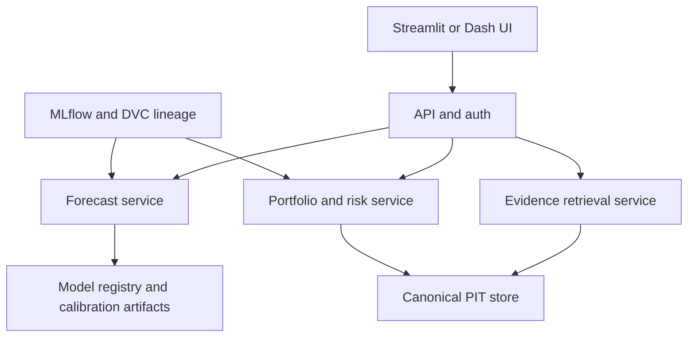
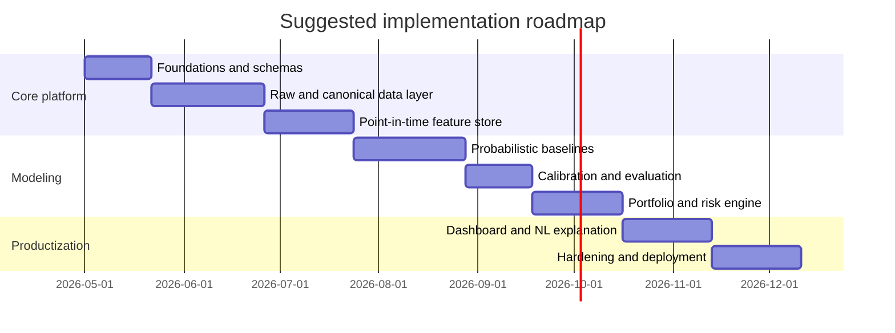

# Python Platform Design for Probabilistic Financial Forecasting and OSINT Intelligence

## Executive summary

The most defensible design is a **point-in-time, provenance-first, probabilistic research platform** that starts with **daily equities and ETFs**, official filings and macro releases, and a strict separation between **raw evidence**, **normalized facts**, **features**, **probability models**, and **decision rules**. In practical terms, that means: official filing and macro APIs for truth, high-quality licensed market data where needed, **Parquet** as the canonical file format, **DuckDB** for local analytical work, **PostgreSQL** for metadata and workflow state, and explicit publication timestamps on every feature join. If the system is meant to accept detailed user data, that user context should be treated as a separate confidential input layer with its own retention, access-control, and provenance model. citeturn22search6turn22search2turn0search1turn4search0turn4search1turn4search2

For forecasting, the default stack should be **calibrated probabilistic baselines first**, not “deep learning because it sounds expensive and therefore smart.” In finance, a good initial stack is usually a mix of regularized linear or state-space models, volatility models, and gradient-boosted trees, then post-hoc calibration and walk-forward validation. Deep probabilistic sequence models such as DeepAR or Temporal Fusion Transformer become worthwhile when you genuinely need multi-horizon sequence structure, richer exogenous inputs, or large panels of related series. All model choices should be judged by **proper scoring rules, calibration, sharpness, and downstream portfolio utility**, not by raw directional accuracy alone. citeturn15search2turn5search1turn15search7turn14search3turn14search7turn6search0turn6search1turn17search0turn6search5turn5search0

The hard part is not modeling. The hard part is **legal, temporal, and operational integrity**. “Public” does not mean “free to redistribute,” revised macro series are not point-in-time by default, exchange-controlled market data has non-display and redistribution constraints, and OSINT workflows that ingest personal data or profile natural persons can trigger privacy obligations. If the platform is intended for internal research only, the licensing problem is smaller. If it will expose market data, derived signals, or OSINT summaries to third parties, redistribution rights must be designed into the product before you write the first dashboard. citeturn1search0turn0search3turn1search1turn20search0turn2search8turn20search7turn10search7turn10search9turn9search12

The recommended build path is therefore: **daily point-in-time platform → calibrated probabilistic models → cost-aware walk-forward backtests → constrained portfolio/risk engine → explainable dashboard and human review → only then higher-frequency, larger OSINT corpora, or GPU-first deep models**. If the baseline platform cannot demonstrate stable calibration, good provenance, and sensible net-of-cost behavior, adding more data and more neural nets will mostly increase the size of the mistake. citeturn19search2turn24search0turn24search1turn24search14turn9search2

## Assumptions and system boundary

Several key design variables were unspecified, so this report makes explicit assumptions rather than pretending certainty where none was provided.

| Unspecified item | Working assumption used here | Why this assumption is reasonable |
|---|---|---|
| Budget | Open-data-first baseline, with selective upgrades to licensed commercial feeds | Most teams should validate the research loop before paying full enterprise data costs |
| Target asset classes | U.S.-first listed equities and ETFs; extend later to global equities, rates, FX, or futures | This is the cleanest starting point for a unified probabilistic + portfolio pipeline |
| Trading frequency | Daily or end-of-day baseline; intraday only if the strategy truly requires microstructure data | Daily systems are much easier to get right on point-in-time and cost modeling |
| Legal/regulatory remit | Internal research and decision support, not a consumer-credit, employment, or fully automated adverse-decision engine | Privacy and automated-decision rules become materially stricter when people are directly affected |
| Redistribution rights | Internal use only unless separately licensed | Market-data redistribution is a contract problem before it is an engineering problem |

The core product should not be framed as “a stock predictor.” It is better understood as an **all-in-one probabilistic intelligence platform** with five outputs: a probability estimate, a predictive distribution, a portfolio decision recommendation, a fully timestamped evidence trail, and an explanatory narrative that states *why* the probability moved, *what evidence supports it*, and *how reliable the model has historically been under similar regimes*. That framing maps cleanly to proper scoring, calibration, portfolio utility, and auditability. citeturn17search0turn5search0turn7search12turn23search3

A robust output contract should normally include at least the following fields: forecast horizon, target definition, probability or predictive distribution, calibration summary by horizon/regime, confidence or interval coverage status, evidence summary, top drivers, conflicting evidence, model version, training cutoff, source timestamps, and explicit abstention if evidence quality is weak. That last part matters: in an intelligence platform, “no-call” is often more honest than a cosmetically precise but badly calibrated percentage. citeturn6search5turn6search8turn17search0turn23search3

## Data foundation, licensing, and OSINT constraints

The platform should ingest **five input families**: market data, fundamentals/filings, macro data, alternative or OSINT data, and user-supplied context. Every family needs a canonical timestamp model. For market data, that means event time and exchange/session context. For filings and news, that means publication time. For macro, that means release time and revision vintage. For user data, that means submission time, user identity or tenancy, sensitivity label, retention rule, and whether any PII is present. citeturn22search6turn22search2turn0search1turn1search13turn21search0turn21search1turn21search2

A practical minimum input requirement for a serious daily research system is: price, volume, splits, dividends, reference/symbology, delisting or inactive-security awareness, filings and structured company facts, macro release calendars and vintages, and a timestamped text/event feed if OSINT or sentiment is in scope. Minimum historical depth was unspecified, so the sensible baseline assumption is **10–20 years** for daily price history, **8–10+ years** of filing/fundamental history, and **at least one full macro cycle** with revision-aware macro vintages. For intraday or event-driven systems, the required depth is strategy-dependent and should be treated as unspecified until the target horizon is fixed. citeturn27search0turn27search11turn27search12turn0search1turn21search0turn21search1turn21search2

### Required input schema

| Family | Canonical formats | Default research frequency | Point-in-time requirement | Historical depth assumption | Notes |
|---|---|---:|---|---:|---|
| Prices, quotes, trades, corporate actions | Parquet, CSV landing, normalized columnar tables | Daily baseline; intraday optional | Yes | 10–20 years | Include splits, dividends, symbol changes, inactive securities |
| Filings and structured fundamentals | JSON, XBRL, Parquet | Event-driven plus quarterly/annual views | Yes | 8–10+ years | Use filing/publication timestamps, not report period end alone |
| Macro, rates, releases | JSON, CSV, Parquet | Release-driven with carry-forward views | **Vintage-aware** | Full cycle | Revision history matters for nowcasting and regime features |
| News, transcripts, web/OSINT | JSON, text, HTML/WARC, embeddings | Event-driven | Yes | Strategy-dependent | Track source URL, retrieved time, published time, license, hash |
| User-supplied context | JSON + document payloads | Ad hoc | Yes | Tenant-defined | Classify PII, confidentiality, and retention explicitly |

The data-source stack should be layered: **official/primary sources first**, then commercial normalizers where they materially improve quality, coverage, or legal clarity.

### Data source comparison

| Source class | Recommended source | What it is best for | Key licensing / usage caveat | Primary refs |
|---|---|---|---|---|
| Official filings | **entity["organization","U.S. Securities and Exchange Commission","us regulator"]** EDGAR / XBRL / company facts | Free primary source for filings, submission history, structured financial facts, and filing timestamps | Excellent raw truth, but you must enforce your own point-in-time joins and schema normalization | citeturn22search6turn22search2turn22search18turn0search4 |
| Official U.S. macro | **entity["organization","Federal Reserve Bank of St. Louis","us central bank branch"]** FRED / ALFRED | Economic series, release history, and revision/vintage-aware retrieval | FRED has API terms; some series can carry third-party restrictions | citeturn1search13turn0search1turn1search0 |
| Official U.S. macro | **entity["organization","U.S. Bureau of Economic Analysis","us economic agency"]** API | GDP, national accounts, regional and industry data | Public official source; still model release timing explicitly | citeturn21search0turn21search4 |
| Official U.S. macro | **entity["organization","U.S. Bureau of Labor Statistics","us labor agency"]** API | Labor and inflation-related releases | Public API; still use release timestamps and schedule discipline | citeturn21search1turn21search5turn21search9 |
| Official international macro | **entity["organization","European Central Bank","eu central bank"]** Data Portal API | Euro-area rates, banking, and statistical series via SDMX API | Official and structured; still manage release timing and metadata | citeturn0search2turn0search10turn0search14 |
| Official international macro | **entity["organization","World Bank","development bank"]** APIs | Long-horizon country indicators and metadata | Some datasets/indicators are third-party and may have extra redistribution limits | citeturn21search3turn21search7turn0search3turn0search11 |
| Official international macro | **entity["organization","International Monetary Fund","global lender"]** APIs | WEO-style macro series, DataMapper, macro-financial indicators | Good for country and aggregate macro; treat release/vintage properly | citeturn21search2turn21search10turn21search14 |
| Official / exchange-controlled market data | CTA / UTP SIP feeds and **entity["organization","New York Stock Exchange","us exchange"]** proprietary feeds | Consolidated quotes/trades and high-fidelity direct-feed microstructure | Exchange licensing, entitlements, non-display and redistribution obligations are the main constraint | citeturn2search0turn2search5turn2search2turn2search8turn20search7 |
| Marketplace / mixed-source data | **entity["company","Nasdaq","exchange operator"]** Data Link | Mixed free/premium financial, economic, and alternative datasets | Publisher-specific terms vary; do not assume uniform openness | citeturn2search3turn2search7turn2search15 |
| Developer-grade freemium | **entity["company","Alpha Vantage","market data api vendor"]** | Fast prototyping and lightweight apps | Real-time U.S. market data is exchange-regulated; commercial rights differ from personal use | citeturn1search1turn1search8turn1search11 |
| Developer-grade licensed | **entity["company","Databento","market data vendor"]** | Normalized historical and live data, schemas from OHLCV to order book | Dataset-specific commercial rights still matter | citeturn1search2turn1search6turn1search12 |
| Developer-grade licensed | **entity["company","Polygon","market data vendor"]** | Real-time / historical API workflows and app integration | Explicit market-data terms and subscriber-agreement incorporation | citeturn20search0turn20search1 |
| Enterprise-grade | **entity["company","Bloomberg","financial data company"]** B-PIPE / enterprise data | Broad cross-asset, normalized enterprise feeds and research datasets | Expensive, contract-heavy, operationally serious, but legally cleaner at scale | citeturn3search0turn3search7turn3search10turn3search13 |
| Enterprise-grade | **entity["company","FactSet","financial data company"]** | APIs, transcripts, signals, marketplace feeds | Strong enterprise coverage; licensing governs downstream use | citeturn3search2turn3search9turn3search22turn3search27 |
| Research-grade historical | **entity["organization","Wharton Research Data Services","academic data platform"]** with CRSP / Compustat | Academic-quality backtests, identifier history, delistings, point-in-time fundamentals | Usually subscription-based, but materially better for rigorous history and linkage | citeturn27search0turn27search3turn27search11turn27search17turn27search12 |
| Open OSINT event/news | GDELT, optional Common Crawl | Broad text/event monitoring and large-scale public-web research | Open does not mean zero legal risk; provenance, copyright, and ToS still matter | citeturn22search4turn22search0turn22search12turn22search3turn22search7 |

The licensing picture is where many otherwise competent systems quietly become unshippable. Macro and official statistics are often generous, but not universally unrestricted. Market data is more restrictive. Real-time U.S. equities data is exchange-regulated, and vendor market-data terms may incorporate exchange subscriber agreements or distinguish display from non-display and personal from commercial usage. Public web corpora and OSINT feeds also need provenance, attribution, takedown handling, and terms-aware ingestion. citeturn1search0turn0search3turn1search1turn20search0turn2search8turn22search7

The OSINT-specific legal constraints are straightforward in principle and painful in practice. If the platform ingests or infers facts about **natural persons**, you need a lawful basis, minimization, retention rules, and explainability around any profiling. In the EU context, GDPR Article 22 is directly relevant whenever automated profiling or automated decision-making could materially affect an individual. Separately, if any workflow brushes against issuer communications or analyst-channel information, you must avoid material nonpublic information and be conscious of SEC Regulation FD. In plainer English: “publicly accessible” is not a synonym for “safe to use however you want.” citeturn10search0turn9search12turn10search7turn9search5turn10search6

If the system accepts detailed user data, keep that data in a separate confidential plane. Store tenant ID, consent or authority-to-process metadata, sensitivity class, retention rule, encryption status, and deletion lineage. Do not commingle user-private notes with vendor-licensed corpora unless your terms and architecture explicitly allow it. Secrets and sensitive configuration should live in a dedicated secret manager, not in notebooks, `.env` archaeology, or hand-wavy operational theatre. citeturn11search11turn11search3turn9search2turn9search6

## Data platform, schemas, and feature engineering

The data layer should follow a simple but unforgiving structure: **raw landing → validated canonical store → point-in-time feature store → research views → model and decision artifacts**. Store raw payloads exactly as received, including content hash, provider, license tag, retrieval timestamp, original publication timestamp if known, and schema version. Normalize only after validation, and never destroy the raw source. That gives you replayability, auditing, and a sane debugging story when a forecast turns out to be wrong for a reason that is more embarrassing than stochastic uncertainty. citeturn4search0turn4search1turn4search2turn11search4turn11search13

For storage, the best default is **Parquet + DuckDB + PostgreSQL**. Parquet gives efficient, compressed, columnar storage. DuckDB gives fast local analytics and pushdown over Parquet. PostgreSQL gives transactional metadata, workflow state, entity registries, and permissions. If you need higher-frequency operational writes or time-series-heavy serving, add PostgreSQL time-series extensions or hypertables. If you outgrow single-node storage, move the Parquet layer into an object store and version datasets, not just code. citeturn4search0turn4search1turn4search2turn4search3turn11search1turn11search13

Schema design should include three timestamp concepts everywhere they matter: `observed_at`, `published_at`, and `ingested_at`. For fundamentals and filings, add `effective_from` and `effective_to` if you maintain point-in-time snapshots. For user data, add `submitted_at`, `sensitivity_class`, and `retention_until`. For text and OSINT, include URL, source domain, language, extraction status, content hash, entity IDs, and confidence scores from entity extraction. If you skip these fields, you are effectively choosing future confusion as a service. citeturn22search6turn0search1turn25search0turn11search4

A suitable high-level platform flow is:


This architecture maps cleanly onto a Python stack using typed validation, analytical storage, experiment tracking, and workflow orchestration. Pydantic is strong for schema validation, Polars and DuckDB are strong for transformations and query efficiency, and MLflow or DVC are strong for lineage and reproducibility. citeturn15search0turn15search1turn4search1turn11search4turn11search13

Feature engineering should combine **market microstructure or technical features**, **fundamental features**, **macro/regime variables**, **OSINT/event features**, and **user-context overlays**. On the market side, use returns, multi-horizon momentum and reversal, realized volatility, downside volatility, volume and turnover, liquidity proxies, gap behavior, beta/exposure residuals, and sector-relative ranking. On the fundamental side, use profitability, leverage, valuation, accruals, cash conversion, revision-sensitive filing features, and corporate-action-aware denominators. On the macro side, use rates, inflation, term spreads, labor, growth nowcasts, and regime states. On the OSINT side, use event arrival counts, issuer-specific sentiment, entity co-mentions, subject taxonomies, sanctions or regulatory events, and source-quality features. The user overlay can include benchmark choice, risk appetite, sector exclusions, conviction priors, watchlists, and scenario assumptions. citeturn22search2turn0search1turn21search0turn21search1turn25search0turn25search2turn22search1

The important rule is that **every feature must be lagged to the first tradable instant at which it was actually knowable**. That means filing-based features activate on filing availability, macro features use the vintage known at the forecast time, and text features key off publication time, not event time inferred after the fact. For tabular joins, `merge_asof`-style logic is the correct primitive because you usually want the latest known value as of a forecast timestamp, never the nearest future value. citeturn0search1turn0search9turn25search3turn25search7

For NLP and OSINT, a pragmatic baseline is **entity extraction + classification before any generative explanation layer**. Use named entity recognition to identify companies, products, locations, and regulators; use sequence classification for sentiment, event taxonomy, or stance; then aggregate those outputs into structured event features. If you add an LLM layer for natural-language Q&A, keep it downstream of the evidence pipeline so it explains retrieved facts instead of hallucinating them. That is the difference between an intelligence system and a fiction engine with a finance vocabulary. citeturn25search0turn25search20turn25search2turn25search10

A simple point-in-time join pattern looks like this:

```python
from __future__ import annotations

import pandas as pd


def point_in_time_join(
    left_market: pd.DataFrame,
    right_facts: pd.DataFrame,
    by: list[str],
) -> pd.DataFrame:
    """
    Join the latest known fact as of each market timestamp.

    left_market must contain:
      - event_time
      - columns in `by`

    right_facts must contain:
      - published_at
      - columns in `by`
      - one or more feature columns
    """
    left = left_market.sort_values(["event_time", *by]).copy()
    right = right_facts.sort_values(["published_at", *by]).copy()

    joined = pd.merge_asof(
        left=left,
        right=right,
        left_on="event_time",
        right_on="published_at",
        by=by,
        direction="backward",
        allow_exact_matches=True,
    )

    return joined
```

This uses the same logic embodied by `pandas.merge_asof`: sorted, time-aware joins that choose the most recent known fact at or before the forecast timestamp. citeturn25search3turn25search7

## Probabilistic models, calibration, and uncertainty quantification

The model stack should be chosen by the forecast target, not by fashion. In a financial intelligence platform you typically want several target types: binary event probabilities, ordinal risk states, continuous return distributions, volatility distributions, and scenario-conditioned outcomes. That naturally suggests a **multi-model probabilistic stack**, not one universal model pretending it understands every regime and data modality equally well. citeturn17search0turn6search0turn6search1

### Model-family comparison

| Family | Typical output | Strengths | Weaknesses | Compute profile | First hyperparameters to tune | Primary refs |
|---|---|---|---|---|---|---|
| Regularized logistic / linear / factor models | Binary probabilities, expected return, or exposure-adjusted scores | Transparent, fast, stable, easy to calibrate and audit | Limited nonlinear interactions | Low CPU | regularization strength, lookback, feature standardization, decay weights | citeturn19search17turn17search0 |
| ARIMA / SARIMAX / state-space | Parametric predictive distributions for time-series targets | Interpretable, handles exogenous regressors, Kalman-style state updates | Weaker on large nonlinear cross-sections | Low CPU | order terms, seasonal terms, exogenous lag structure, rolling window length | citeturn5search1turn15search2turn15search6 |
| ARCH / GARCH / HAR-style volatility models | Volatility and interval/risk forecasts | Purpose-built for heteroskedasticity and clustered variance | Usually not the best main alpha engine | Low CPU | volatility order, residual distribution, mean model, refit cadence | citeturn15search7turn15search19turn15search11 |
| Bayesian structural time series / dynamic models | Posterior predictive distributions, regime-aware nowcasts | Explicit uncertainty, interpretability, good for macro + event nowcasting | Slower and more model-design-intensive than plain regression | Low to medium CPU | prior structure, sparsity prior, state components, forecast horizon | citeturn23search0turn23search1turn23search13 |
| Gaussian processes | Nonparametric predictive mean + uncertainty | Strong uncertainty story, flexible kernels, useful for smaller problems | Scaling gets painful on big panels | Medium to high CPU/RAM | kernel choice, length scales, noise term, inducing-point strategy | citeturn23search2 |
| Gradient-boosted trees | Calibrated probabilities, quantile-style or ranking-oriented outputs | Excellent default for tabular mixed signals and interactions | Can overfit if labels or time logic leak | Medium CPU, optional GPU | learning rate, depth/leaves, subsample, colsample, min child weight, regularization | citeturn14search3turn14search7turn14search15 |
| DeepAR-style sequence models | Parametric predictive distributions for related series | Strong for related time-series panels and sequence structure | Data-hungry, slower, less interpretable | GPU helpful | context length, hidden size, likelihood family, dropout, LR, batch size | citeturn6search0turn16search13 |
| TFT-style models | Multi-horizon quantiles/probabilities with attention and interpretability hooks | Strong for multi-horizon sequences with static and dynamic covariates | Highest complexity tax and GPU dependency | High GPU | context length, hidden width, heads, dropout, LR schedule, quantile set | citeturn6search1turn16search1turn16search22 |
| Deep ensembles / conformal wrappers | Better uncertainty or distribution-free coverage | Useful uncertainty upgrade on top of many base models | Increased training cost, exchangeability assumptions for conformal methods | Medium to high | ensemble size, bootstrap/resampling, conformity score design, calibration split | citeturn26search7turn26search4turn26search1 |

The sensible order of operations is blunt: start with **regularized tabular models, state-space models, and boosted trees**, then add Bayesian or deep sequence models only when the data shape and business problem clearly justify them. For many stock-market tasks, tabular features plus careful time logic beat more ornate deep models simply because the engineering around labels, lags, and costs matters more than architectural cleverness. citeturn14search3turn15search2turn24search0

Uncertainty quantification can be obtained in several ways. Classical models provide parametric predictive distributions; Bayesian models provide posterior predictive uncertainty; tree or neural systems can emit class probabilities or quantiles directly; deep ensembles help with epistemic uncertainty; and conformal methods can wrap many base models to produce distribution-free coverage guarantees under their assumptions. In practice, a strong production design often uses **native model probabilities + post-hoc calibration + conformal or interval-level diagnostics**, because no single uncertainty trick is uniformly trustworthy under regime shift. citeturn6search0turn6search1turn26search7turn26search4turn26search1turn17search0

Calibration deserves its own explicit layer. For discrete probabilities, start with sigmoid/Platt, isotonic, or temperature-style scaling on held-out data, not on the same folds used to fit the base model. Reliability diagrams and calibration curves should be standard artifacts in every model report. For continuous probabilistic forecasts, use CRPS and coverage diagnostics, and consider recalibration if interval coverage drifts materially. citeturn6search5turn6search2turn6search8turn6search17turn7search1turn7search12turn23search7

A good baseline for event probabilities is a boosted-tree classifier with cross-validated calibration:

```python
from __future__ import annotations

import numpy as np
import pandas as pd
from sklearn.calibration import CalibratedClassifierCV
from sklearn.metrics import brier_score_loss, log_loss
from sklearn.model_selection import TimeSeriesSplit
from xgboost import XGBClassifier


def train_calibrated_event_model(X: pd.DataFrame, y: pd.Series):
    """
    Binary probabilistic model for an event such as:
    future_20d_excess_return > 0
    """
    base = XGBClassifier(
        n_estimators=400,
        max_depth=4,
        learning_rate=0.03,
        subsample=0.8,
        colsample_bytree=0.8,
        reg_lambda=1.0,
        tree_method="hist",
        eval_metric="logloss",
        n_jobs=-1,
    )

    # Calibration must be done on held-out folds, not on the fit sample.
    model = CalibratedClassifierCV(
        estimator=base,
        method="isotonic",   # or "sigmoid"
        cv=3,
    )
    model.fit(X, y)
    return model


def evaluate_probs(model, X_test: pd.DataFrame, y_test: pd.Series) -> dict[str, float]:
    proba = model.predict_proba(X_test)[:, 1]
    return {
        "brier": float(brier_score_loss(y_test, proba)),
        "log_loss": float(log_loss(y_test, proba)),
        "mean_prob": float(np.mean(proba)),
    }
```

This matches the documented calibration workflow in scikit-learn and the standard XGBoost parameterization pattern for tree boosters. citeturn6search2turn6search5turn14search7turn14search15

## Evaluation, backtesting, and portfolio decision rules

If the output is probabilistic, then the evaluation must also be probabilistic. That means **Brier score**, **log-loss**, and **CRPS** are first-class metrics; calibration and sharpness are not “nice to have”; and directional accuracy should be treated as a side metric, not the main judge. Gneiting and Raftery’s framework remains the right mental model here: a useful forecast is both **calibrated** and **sharp**, and proper scoring rules explicitly reward truthful probability forecasts. citeturn17search0turn5search0turn7search12

At the prediction layer, your evaluation pack should normally include Brier score or log-loss for binary events; CRPS for continuous predictive distributions; calibration curves or reliability diagrams; interval coverage versus nominal coverage; and regime-segmented performance by volatility, trend, sector, and macro state. At the portfolio layer, add net return, volatility, drawdown, Sharpe, turnover, cost drag, exposure drift, hit rate conditional on signal bins, and utility realized under the actual sizing rule. A model can be statistically decent and economically useless, or vice versa; you need both views. citeturn5search0turn6search8turn6search11turn23search3

Validation should be **walk-forward by default**. Scikit-learn’s `TimeSeriesSplit` is a good starting primitive and its `gap` parameter is helpful. In finance, however, that is not always enough because labels can overlap in time and leak future path information. For those cases, implement explicit **purging and embargo** logic, and if you run large hyperparameter or model sweeps, consider combinatorial/purged finance-style cross-validation and multiple-testing corrections. Otherwise you are doing backtests the way a stage magician does honesty. citeturn19search2turn19search5turn19search13turn24search7turn24search0turn24search14

You also need data-snooping defenses. White’s Reality Check, the probability of backtest overfitting, and the Deflated Sharpe Ratio all exist because repeated model search on the same historical sample can produce impressive nonsense. Any roadmap that includes dozens of signal variants, feature combinations, and thresholds without corresponding overfitting controls is not “research intensity”; it is just a more expensive route to self-deception. citeturn24search1turn24search0turn24search4turn24search14

Transaction costs, slippage, and execution constraints must be in the simulator, not stapled on at the end. At minimum: commissions, spread, market impact or participation limits, borrow costs if shorting, stale or missing prints, corporate-action adjustments, and delays between signal time and tradable time. Open-source frameworks such as Zipline and Backtrader explicitly model commission and slippage because these are central to reality, not edge-case footnotes. citeturn19search0turn19search1turn19search6

A compact walk-forward evaluator can look like this:

```python
from __future__ import annotations

from dataclasses import dataclass
import numpy as np
import pandas as pd
from sklearn.metrics import brier_score_loss, log_loss
from sklearn.model_selection import TimeSeriesSplit


@dataclass
class FoldMetrics:
    fold: int
    brier: float
    logloss: float
    turnover: float
    gross_return: float
    net_return: float


def walk_forward_prob_eval(
    X: pd.DataFrame,
    y: pd.Series,
    builder,
    returns_next: pd.Series,
    threshold: float = 0.55,
    cost_bps: float = 10.0,
    n_splits: int = 6,
    gap: int = 5,
) -> list[FoldMetrics]:
    splitter = TimeSeriesSplit(n_splits=n_splits, gap=gap)
    out: list[FoldMetrics] = []

    for fold, (tr, te) in enumerate(splitter.split(X), start=1):
        model = builder()
        model.fit(X.iloc[tr], y.iloc[tr])

        p = model.predict_proba(X.iloc[te])[:, 1]
        signal = (p >= threshold).astype(float)  # long / flat example
        turnover = np.abs(np.diff(np.r_[0.0, signal])).sum()
        gross = float(np.dot(signal, returns_next.iloc[te]))
        costs = float(turnover * (cost_bps / 1e4))
        net = gross - costs

        out.append(
            FoldMetrics(
                fold=fold,
                brier=float(brier_score_loss(y.iloc[te], p)),
                logloss=float(log_loss(y.iloc[te], p)),
                turnover=float(turnover),
                gross_return=gross,
                net_return=net,
            )
        )

    return out
```

This is intentionally plain. A production engine should support overlapping labels, embargo logic, scenario paths, borrow costs, volume caps, and benchmark-relative attribution. The skeleton is still useful because it forces you to evaluate the thing you actually care about: calibrated probabilities mapped into a tradable decision process. citeturn19search2turn5search0turn19search0

Portfolio construction should explicitly consume probabilistic forecasts rather than pretending a point forecast is enough. A clean pattern is: convert probabilities into expected utility or scenario-weighted expected returns, combine that view with volatility or scenario risk, then optimize under constraints and turnover penalties.

### Portfolio-method comparison

| Method | Best use | Strengths | Main risk | Decision-rule fit with probabilistic forecasts | Primary refs |
|---|---|---|---|---|---|
| Mean-variance / min-variance | Baseline optimizer with covariances and return views | Canonical, simple, constraint-friendly | Sensitive to estimation error in expected returns | Use scenario-weighted expected returns and strong constraints | citeturn8search0turn14search2 |
| Black-Litterman | When you want to blend market priors with model views | Stabilizes expected returns and lets you express confidence | Priors and confidence settings can still be arbitrary | Very strong fit: map model probabilities into views with confidence scaling | citeturn8search1turn18search2 |
| CVaR / expected shortfall | Tail-sensitive portfolios and stress-heavy mandates | Directly manages downside tail behavior | Needs scenario quality and enough paths | Strong fit: optimize over forecast scenarios rather than only variance | citeturn8search2 |
| Risk parity / equal risk contribution | When return views are weak but risk budgets matter | Robust and diversified by risk contribution | Can ignore alpha and overweight low-vol assets | Good fallback when forecast confidence is low | citeturn18search0turn18search16 |
| Hierarchical Risk Parity | Large universes with unstable covariance estimation | Avoids some instability of classic quadratic optimizers | Less direct expression of subjective/view-based alpha | Good robust allocator when expected-return estimates are noisy | citeturn18search1turn18search9 |
| Kelly / fractional Kelly | Sizing when you have calibrated edge and odds | Theoretically coherent growth-optimal sizing | Brutal sensitivity to estimation error and tail misspecification | Use **fractional**, volatility-scaled Kelly only, never full-Kelly bravado | citeturn8search3 |

The portfolio rule should be **forecast-aware and uncertainty-aware**. If the model says `P(outperform) = 0.56` with weak calibration in similar regimes, size that very differently from `P(outperform) = 0.72` with stable calibration and low epistemic uncertainty. In other words, the optimizer should consume not just expected return but also confidence, scenario dispersion, liquidity, and turnover budget. Fractional Kelly or utility-based sizing can map forecast strength to risk, but full Kelly in noisy financial systems is usually how you convert statistical optimism into operational pain. citeturn8search3turn17search0turn24search14

Typical optimizer constraints should include long-only or bounded shorting, gross/net exposure, sector and style caps, maximum weight, minimum liquidity, turnover ceiling, beta or factor neutrality if required, and rebalance buffers. CVXPY is an excellent fit because the real object here is a constrained optimization problem, not an inspirational quote about diversification. citeturn14search2turn14search18

A minimal probabilistic optimizer looks like this:

```python
from __future__ import annotations

import cvxpy as cp
import numpy as np


def prob_to_expected_return(p_up: np.ndarray, up_move: np.ndarray, down_move: np.ndarray) -> np.ndarray:
    """
    Translate binary event probabilities into expected returns.
    down_move should typically be negative.
    """
    return p_up * up_move + (1.0 - p_up) * down_move


def optimize_portfolio(
    mu: np.ndarray,
    cov: np.ndarray,
    w_prev: np.ndarray,
    max_weight: float = 0.05,
    lambda_risk: float = 8.0,
    lambda_turnover: float = 1.0,
) -> np.ndarray:
    n = len(mu)
    w = cp.Variable(n)

    objective = cp.Maximize(
        mu @ w
        - lambda_risk * cp.quad_form(w, cov)
        - lambda_turnover * cp.norm1(w - w_prev)
    )

    constraints = [
        cp.sum(w) == 1.0,
        w >= 0.0,
        w <= max_weight,
    ]

    problem = cp.Problem(objective, constraints)
    problem.solve(solver=cp.OSQP)

    if w.value is None:
        raise RuntimeError("optimization failed")
    return np.asarray(w.value)
```

If you need tail control, replace the quadratic risk term with a scenario-based CVaR objective or constraint using simulated or model-generated forecast paths. citeturn14search2turn8search2

## Governance, explainability, user interface, and software architecture

A platform of this kind should be built as a collection of **clear modules**, not a research notebook landfill. A reasonable package layout is:

```text
forecast_intel/
  config/
  schemas/
  connectors/
  raw_store/
  canonical_store/
  entity_nlp/
  features/
  models/
  calibration/
  validation/
  portfolio/
  risk/
  reports/
  api/
  ui/
  tests/
```

At the application layer, **FastAPI** and **Pydantic** are strong defaults: typed interfaces, validation, predictable request/response contracts, and pain avoidance. For research transforms, **Polars** and **DuckDB** are a high-leverage combination. For optimization, **CVXPY**. For classical time series and volatility, `statsmodels` and `arch`. For ML, scikit-learn and XGBoost. For deep learning, PyTorch or libraries built on it. For experiment tracking and lineage, MLflow and DVC. For orchestration, Prefect is a strong Python-native choice for data workflows. citeturn14search1turn15search0turn15search1turn4search1turn14search2turn15search2turn15search7turn14search3turn16search0turn11search4turn11search13turn11search2

Explainability should be designed as a first-class output, not a post-hoc apology. For tree ensembles, SHAP is a strong default because Tree SHAP gives fast exact explanations for many tree models. For NLP event extraction, use entity recognition and classification first; then surface top evidence documents, source timestamps, entity links, and whether the explanation came from model attribution versus retrieved text. For any natural-language summary, the UI should show both the **numerical probability** and the **evidence provenance** side by side. If a user cannot click from the sentence to the evidence, you have built a persuasive interface, not an auditable one. citeturn25search1turn25search13turn25search0turn25search2

The UI depends on audience. **Streamlit** is excellent for internal analyst apps and rapid iteration. **Dash** is better when you want richer app structure and more explicit component control. **Plotly** is a strong default for interactive visualizations. **Gradio** is useful when the platform leans more heavily into model demos, natural-language Q&A, or quick chat-style interfaces. A good frontend should expose forecast probability, reliability diagram, feature contributions, evidence timeline, source table, scenario results, and human override controls in one place. citeturn12search0turn12search1turn12search2turn12search3turn12search20

The minimum chart pack I would insist on is:

- reliability diagram / calibration curve by target and horizon,
- sharpness histogram of output probabilities,
- rolling Brier score and log-loss,
- prediction interval coverage versus nominal coverage,
- cumulative net returns, drawdown, and turnover-cost decomposition,
- factor or sector exposure drift,
- efficient frontier, CVaR frontier, or risk-contribution bars,
- feature importance drift and entity-frequency drift for NLP/OSINT features. citeturn6search8turn6search11turn5search0turn7search12turn12search2

A small dashboard stack can be sketched like this:



Governance needs four things: **audit trails, human-in-the-loop controls, explainability, and safe failure modes**. Every forecast should log model version, training cutoff, feature set hash, calibration object, source set, user inputs, overrides, and downstream decision result. Analysts should be able to mark evidence as irrelevant, reject an entity resolution, or override a recommendation with a reason code. High-impact decisions should require sign-off rather than silent auto-execution. Finance loves automation right until the day automation becomes documentary evidence. citeturn11search4turn11search13turn9search2

Security should follow a boring, competent baseline: NIST SSDF-aligned software practices, secrets in a real secrets manager, dependency scanning, package pinning, CI-based testing, and containerized deployment. That means a proper packaging layout, pytest-based tests, GitHub Actions or equivalent CI/CD, and Docker-based runtime packaging. If you deploy on premises, keep the same discipline; on-prem does not magically convert weak process into strong security. citeturn9search2turn9search6turn9search3turn13search0turn13search1turn13search6turn13search10turn13search13turn13search19turn11search11

A lightweight ingestion schema using Pydantic might look like this:

```python
from __future__ import annotations

from datetime import datetime, timezone
from typing import Literal, Optional

from pydantic import BaseModel, HttpUrl, Field


class RawDocument(BaseModel):
    source: Literal["sec", "fred", "bea", "bls", "gdelt", "user", "vendor"]
    source_id: str
    retrieved_at: datetime = Field(default_factory=lambda: datetime.now(timezone.utc))
    published_at: Optional[datetime] = None
    url: Optional[HttpUrl] = None
    license_tag: str
    pii_class: Literal["none", "low", "restricted"] = "none"
    tenant_id: Optional[str] = None
    content_hash: str
    payload: dict


def ingest_record(record: dict) -> RawDocument:
    """
    Validate inbound data before it lands in the raw store.
    """
    return RawDocument.model_validate(record)
```

This pattern is boring in the best possible way: typed, explicit, and easy to test. citeturn15search0turn14search1turn13search1

## Roadmap, milestones, and go or no-go gates

A sensible roadmap is phased so that you can stop early if the evidence turns ugly. That matters because in this class of system the worst outcome is not “we learned nothing”; it is “we built a sophisticated machine that confidently industrializes weak signals.”



### Phase plan

| Phase | Main deliverables | Estimated effort | Go / no-go criteria |
|---|---|---:|---|
| Foundations | Repository, package structure, schemas, env/config, CI, test harness | 2–3 weeks | Reproducible builds, typed contracts, passing unit tests |
| Raw and canonical data | Connectors, rate limiting, raw store, provenance metadata, Parquet normalization, metadata DB | 4–5 weeks | Point-in-time timestamps preserved; failed ingestions are observable and replayable |
| Feature store | PIT joins, lagging rules, entity extraction, OSINT normalization, user-data separation | 3–4 weeks | No look-ahead in feature tests; unit tests for temporal joins pass |
| Probabilistic baseline models | Logistic/tree/state-space baselines, volatility models, simple ensembles | 4–5 weeks | Beat naive baselines on proper scoring rules out of sample |
| Calibration and validation | Reliability diagrams, Brier/log-loss/CRPS, walk-forward, purging/embargo, cost simulation | 3–4 weeks | Calibration acceptable by horizon/regime; no obvious overfitting flags |
| Portfolio/risk engine | Utility rules, Kelly fractions, Black-Litterman or CVaR variants, constraints and rebalancing | 3–4 weeks | Net-of-cost results stable across folds and stress scenarios |
| UI and explanations | Streamlit/Dash interface, evidence explorer, model report cards, override workflow | 3–4 weeks | Analysts can trace every output back to evidence and model version |
| Hardening and deployment | Secret management, SCA, containerization, deployment automation, audit logs | 3–4 weeks | Security controls, rollback path, and audit trails verified |

If one experienced engineer owns this end to end, a realistic early-production target is roughly **22–31 weeks**. A small, focused team can shorten the calendar, but only if the data contracts and legal/licensing questions are resolved early. Otherwise the project becomes a meeting generator with a Python side quest. citeturn9search2turn11search2turn11search11turn13search10

The go/no-go gates should be explicit. I would stop or redesign if any of the following happens: calibration remains materially unstable across regimes; point-in-time tests keep failing because source timestamps are unreliable; market-data or redistribution licensing is unclear; the best strategy vanishes net of realistic costs; or human reviewers cannot explain why a probability changed without reverse-engineering notebooks. Those are not polish issues. Those are architecture verdicts. citeturn24search0turn24search14turn20search0turn2search8turn17search0

## Open questions and limitations

This design is rigorous, but several high-impact choices remain unresolved because your prompt intentionally left them open:

- **Asset classes and venues** were unspecified. Rates, futures, options, FX, or global equities would materially change the data and execution layer.
- **Trading frequency** was unspecified. If the real goal is intraday or event-driven trading, the legal, cost, and microstructure burden rises sharply.
- **Legal/regulatory remit** was unspecified. Internal institutional research is one thing; consumer-facing advice, external redistribution, or models affecting identifiable persons are another.
- **Redistribution rights** were unspecified. This is a contract-design issue that can dominate the whole product.
- **User-data sensitivity** was unspecified. If the platform will ingest private customer, employee, or founder information, privacy governance has to move from “good practice” to “formal control environment.”

Given those unknowns, the best initial target is still clear: **an internal, daily, point-in-time, evidence-backed probabilistic research platform for listed equities and ETFs**, with rigorous calibration, explicit provenance, human review controls, and constrained portfolio rules. That gives you the highest learning rate with the lowest chance of building an impressive liability.
